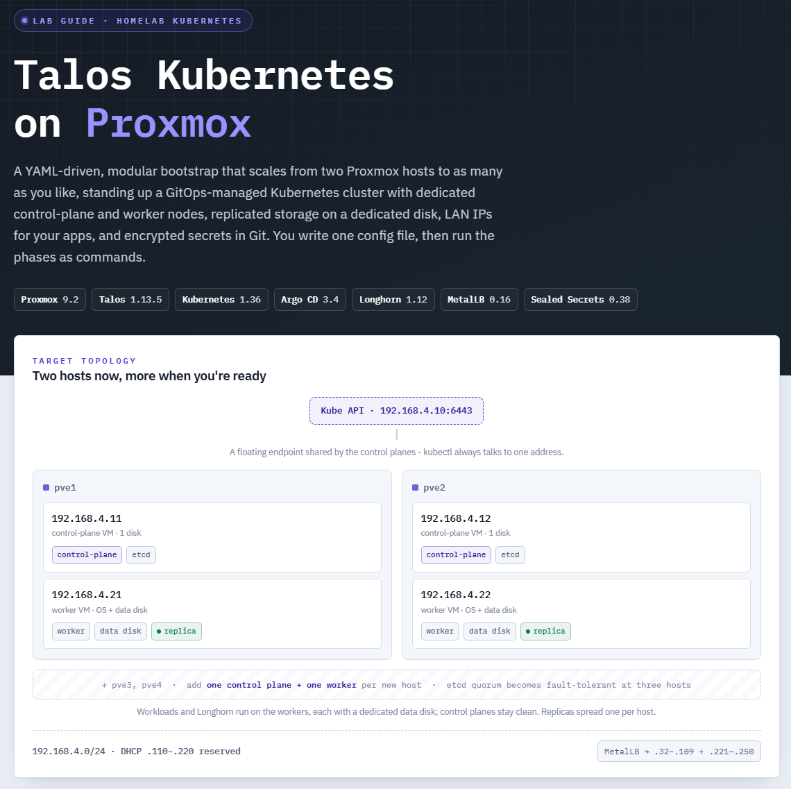

# Talos-Lab

<div align="center">



**Production-ready Kubernetes on Proxmox via Talos Linux**

[](https://www.talos.dev/)
[](https://kubernetes.io/)
[](LICENSE)

</div>

---

## Quick Start

```bash
# 1. Configure your cluster
cp cluster.example.yaml secrets/cluster.yaml
$EDITOR secrets/cluster.yaml  # Set IPs, versions, node topology

# 2. Bootstrap everything
./bootstrap.sh

# 3. Verify
export KUBECONFIG=secrets/kubeconfig
kubectl get nodes
```

**Done.** You now have a complete Kubernetes cluster with GitOps, replicated storage, and load balancing.

---

**📖 [View Complete Lab Guide](https://will4950.github.io/Talos-Lab/lab-guide.html)** - Deep walkthrough with architecture deep-dives, network design rationale, and troubleshooting edge cases.

---

## What You Get

A complete, GitOps-ready Kubernetes stack deployed across your Proxmox homelab:

- **[Talos Linux](https://www.talos.dev/) v1.13.5** - Immutable, API-driven OS (no SSH, pure Kubernetes)
- **Kubernetes 1.36** - Latest stable release
- **[Argo CD](https://argoproj.github.io/cd/)** - GitOps continuous delivery (optional app-of-apps)
- **[Longhorn](https://longhorn.io/) 1.12** - Replicated block storage on dedicated disks
- **[MetalLB](https://metallb.universe.tf/) v0.16.1** - L2 LoadBalancer IPs on your LAN
- **[Sealed Secrets](https://sealed-secrets.netlify.app/) 0.38.4** - Encrypt secrets for Git
- **Self-hosted VIP** - Floating API endpoint via `talos-vip` (no external load balancer)

---

## Prerequisites

### Hardware

- **2+ Proxmox hosts** (9.x) on the same L2 network
- Each host runs **1 control-plane + 1 worker** node (VMs)
- 3+ hosts recommended for fault-tolerant etcd quorum

### Software

Install these on your workstation:

- [`talosctl`](https://www.talos.dev/latest/introduction/quickstart/) - Talos cluster management
- [`kubectl`](https://kubernetes.io/docs/tasks/tools/) - Kubernetes CLI
- [`yq`](https://github.com/mikefarah/yq) - YAML processor (v4+)
- `jq`, `curl` - JSON processing, HTTP requests
- [`kubeseal`](https://github.com/bitnami-labs/sealed-secrets/releases) - Sealed Secrets CLI (optional)

### Network

- **DHCP server** with static reservations (or OPNsense with API access)
- **Outbound internet** for image pulls
- **L2 broadcast domain** - ARP must flood across all Proxmox hosts for VIP
- **Proxmox firewall OFF** on control-plane VM NICs (required for VIP)

---

## Architecture

### Role Separation

Each Proxmox host runs **two VMs**:

- **1 Control Plane** - etcd + Kubernetes API server (small, dedicated)
- **1 Worker** - Workloads + Longhorn storage (larger, resource-heavy)

This isolates etcd from workload contention and simplifies maintenance.

### Self-Hosted VIP

Uses Talos' built-in **`talos-vip`** feature:

- Control planes elect a VIP owner via etcd leader election
- Floating IP answers for the Kubernetes API endpoint
- No external load balancer required

```
┌─────────────────────────────────────────────────────────┐
│                   API VIP: 192.168.4.10                 │
│              (floats across control planes)             │
└──────────────┬─────────────────────────┬────────────────┘
               │                         │
       ┌───────▼────────┐       ┌───────▼────────┐
       │  pve1          │       │  pve2          │
       ├────────────────┤       ├────────────────┤
       │ CP  .11  etcd  │       │ CP  .12  etcd  │
       │ WRK .21  pods  │       │ WRK .22  pods  │
       └────────────────┘       └────────────────┘
```

### Network Design

Example subnet `192.168.4.0/24`:

| Range       | Purpose             |
| ----------- | ------------------- |
| `.10`       | API VIP (floating)  |
| `.11-.14`   | Control planes      |
| `.21-.24`   | Workers             |
| `.32-.109`  | MetalLB pool (low)  |
| `.110-.220` | DHCP range          |
| `.221-.250` | MetalLB pool (high) |
| `.254`      | Gateway             |

---

## Configuration

All cluster config lives in **`cluster.yaml`** (copy from `cluster.example.yaml` to `secrets/cluster.yaml`):

### Versions

```yaml
versions:
  talos: v1.13.5
  kubernetes: "" # blank = bundled with Talos
  argocd: stable
  longhorn: "1.12.0"
  metallb: v0.16.1
```

Bump any version → re-run `./bootstrap.sh update`

### Nodes

```yaml
nodes:
  controlPlanes:
    - { ip: 192.168.4.11, host: pve1, vmid: 1011, mac: "bc:24:11:00:01:01" }
    - { ip: 192.168.4.12, host: pve2, vmid: 1012, mac: "bc:24:11:00:02:01" }
  workers:
    - { ip: 192.168.4.21, host: pve1, vmid: 1021, mac: "bc:24:11:00:01:02" }
    - { ip: 192.168.4.22, host: pve2, vmid: 1022, mac: "bc:24:11:00:02:02" }
```

- **`host`** → becomes `topology.kubernetes.io/zone` label
- **`vmid`** + **`mac`** → only used if `proxmox.provisionVMs: true`
- Add nodes by uncommenting pve3/pve4 lines or adding new entries

### Longhorn (Dedicated Disk)

```yaml
longhorn:
  replicaCount: 2
  # excludeHosts:  # Skip Longhorn storage on these Proxmox hosts
  #   - pve4       # (workers still run, just don't host replicas)
  dedicatedDisk:
    enabled: true
    sizeGB: 100 # created when provisioning VMs
    diskSelector: "!system_disk"
```

Workers need a **second, blank disk** mounted at `/var/mnt/longhorn`. Auto-created if `provisionVMs: true`.

- Use `excludeHosts` to skip storage on hosts with small/overcommitted pools
- Override disk size per-node with `dataDiskGB` in worker definition (e.g., `dataDiskGB: 60`)
- Keep `replicaCount` ≤ storage node count (workers minus excluded hosts)

### MetalLB

```yaml
metallb:
  enabled: true
  pools:
    - name: lan
      addresses:
        - 192.168.4.32-192.168.4.109
        - 192.168.4.221-192.168.4.250
```

108 IPs available for `LoadBalancer` services.

### Optional Features

- **`proxmox.provisionVMs: true`** - Auto-create VMs via SSH (qm)
- **`opnsense.enabled: true`** - Create DHCP reservations via API
- **`argocd.appOfApps.enabled: true`** - Bootstrap GitOps apps from a repo

See [`cluster.example.yaml`](cluster.example.yaml) for full options.

---

## Bootstrap Flow

[`bootstrap.sh`](bootstrap.sh) orchestrates **16 modular phase scripts** in `scripts/`:

```bash
./bootstrap.sh                 # Run all phases
./bootstrap.sh metallb argocd  # Run specific phases
bash scripts/07-metallb.sh     # Direct invocation
```

Phases run in this order (when all features enabled):

1. **schematic** - Build Talos image factory schematic (bakes in extensions)
2. **dhcp** - Create OPNsense DHCP reservations _(optional)_
3. **provision** - Create Proxmox VMs via SSH _(optional)_
4. **config** - Generate Talos configs (with persistent PKI)
5. **apply** - Push configs to nodes via Talos API
6. **bootstrap** - Initialize etcd cluster
7. **kubeconfig** - Fetch credentials + label nodes by failure domain
8. **metallb** - Deploy L2 address pools
9. **argocd** - Deploy Argo CD + optional app-of-apps
10. **longhorn** - Deploy replicated storage
11. **sealed-secrets** - Install sealed-secrets-controller
12. **apps** - Apply any manifests in `manifests/`
13. **info** - Show cluster endpoints + health

Plus operational phases:

- **reconfig** - Add/remove nodes, regenerate configs
- **update** - Rolling upgrades (Talos/Kubernetes/apps)
- **deprovision** - Destroy VMs

---

## Phase Scripts Reference

| Phase              | Script                  | Purpose                                    | Standalone Use                       |
| ------------------ | ----------------------- | ------------------------------------------ | ------------------------------------ |
| **schematic**      | `01-schematic.sh`       | Generate Talos Image Factory schematic URL | Re-run after changing `install.disk` |
| **dhcp**           | `00-dhcp-opnsense.sh`   | Create DHCP reservations on OPNsense       | When adding nodes                    |
| **provision**      | `02-provision-vms.sh`   | Create VMs on Proxmox via SSH              | One-time or when adding hosts        |
| **config**         | `03-gen-config.sh`      | Generate Talos machine configs             | After topology changes               |
| **apply**          | `04-apply-config.sh`    | Push configs to nodes                      | After config regeneration            |
| **bootstrap**      | `05-bootstrap.sh`       | Bootstrap etcd                             | One-time cluster init                |
| **kubeconfig**     | `06-kubeconfig.sh`      | Fetch kubeconfig + label nodes             | After cluster init or reconfig       |
| **metallb**        | `07-metallb.sh`         | Deploy MetalLB L2 pools                    | After IP pool changes                |
| **argocd**         | `08-argocd.sh`          | Deploy Argo CD                             | Re-run to update version             |
| **longhorn**       | `09-longhorn.sh`        | Deploy Longhorn storage                    | Re-run to update Helm values         |
| **sealed-secrets** | `10-sealed-secrets.sh`  | Install sealed-secrets-controller          | Re-run to update version             |
| **apps**           | `11-apps.sh`            | Apply manifests from `manifests/`          | After adding local manifests         |
| **reconfig**       | `12-reconfig.sh`        | Reconfigure cluster (add/remove nodes)     | When scaling                         |
| **update**         | `98-update.sh`          | Rolling version updates                    | When bumping `versions:`             |
| **deprovision**    | `90-deprovision-vms.sh` | Destroy VMs on Proxmox                     | Teardown                             |
| **info**           | `99-info.sh`            | Show cluster endpoints + status            | Anytime                              |

All scripts source [`scripts/lib.sh`](scripts/lib.sh) for config parsing and shared functions.

---

## Critical Constraints

### ⚠️ VIP Requirements

The self-hosted VIP **will not work** if:

- Proxmox firewall is **ON** for control-plane VM NICs (blocks ARP replies)
- ARP broadcasts don't flood across all Proxmox hosts (L2 segment required)
- etcd is unhealthy (leader election fails)

**Symptom**: `talosctl` / `kubectl` timeout connecting to API endpoint.

**Fix**: Disable Proxmox firewall on each control-plane VM NIC:

```bash
pvesh set /nodes/{node}/qemu/{vmid}/config -net0 firewall=0
```

### ⚠️ Two-Host HA Limitation

With **2 hosts** you have **2 control planes**, which:

- ✅ Workloads keep running if one host fails
- ❌ **Cluster goes read-only** without quorum (etcd needs majority)
- ❌ Cannot schedule new pods or modify resources until host returns

**3+ hosts = fault-tolerant quorum** (etcd survives 1 host loss).

### ⚠️ Longhorn Dedicated Disk

Each **storage worker** (workers not on `excludeHosts`) **must** have a second, blank disk:

- Mounted at `/var/mnt/longhorn` via Talos `UserVolumeConfig`
- Auto-created if `provisionVMs: true` and `dedicatedDisk.enabled: true`
- Manual VMs: add a 100GB+ blank disk to each storage worker before deploying Longhorn
- Workers on excluded hosts get no data disk and host no replicas (but still run workloads)

**Symptom**: Longhorn nodes stuck in "Scheduling Disabled" state.

---

## Common Workflows

### Adding a Node

1. Edit `secrets/cluster.yaml` → add node entry under `controlPlanes:` or `workers:`
2. Optionally provision VM: `bash scripts/02-provision-vms.sh`
3. Reconfigure: `bash scripts/12-reconfig.sh`

### Upgrading Versions

1. Edit `secrets/cluster.yaml` → bump `versions.talos` / `versions.kubernetes`
2. Run: `bash scripts/98-update.sh` (rolling upgrade, one node at a time)

### Removing VMs

```bash
bash scripts/90-deprovision-vms.sh
```

Prompts for confirmation before deleting VMs.

---

## Verify Installation

### Cluster Health

```bash
export KUBECONFIG=secrets/kubeconfig
talosctl health --nodes $(yq '.nodes.controlPlanes[0].ip' secrets/cluster.yaml)
kubectl get nodes -o wide
```

All nodes should be `Ready`, control planes labeled `node-role.kubernetes.io/control-plane`.

### MetalLB

```bash
kubectl get ipaddresspool,l2advertisement -n metallb-system
```

Should show your configured IP pools.

### Longhorn

```bash
kubectl get nodes -n longhorn-system -o jsonpath='{range .items[*]}{.metadata.name}{"\t"}{.status.conditions[?(@.type=="Ready")].status}{"\n"}{end}'
```

All storage worker nodes should report `SchedulingEnabled` (workers on excluded hosts won't appear).

### Test LoadBalancer

```bash
kubectl create deployment nginx --image=nginx
kubectl expose deployment nginx --port=80 --type=LoadBalancer
kubectl get svc nginx  # Wait for EXTERNAL-IP
curl http://<EXTERNAL-IP>
```

---

## Troubleshooting

| Symptom                    | Likely Cause                       | Fix                                                      |
| -------------------------- | ---------------------------------- | -------------------------------------------------------- |
| **VIP not reachable**      | Proxmox firewall blocking ARP      | Disable firewall on CP NICs: `firewall=0`                |
| **etcd unhealthy**         | Host loss (2-host cluster)         | Restore host or tolerate read-only until recovery        |
| **Longhorn node down**     | Data disk not mounted              | Check `/var/mnt/longhorn` exists, `diskSelector` matches |
| **MetalLB no EXTERNAL-IP** | IP pool exhausted or misconfigured | Check `kubectl get ipaddresspool -n metallb-system`      |
| **Image pull failures**    | DNS / outbound internet blocked    | Verify `network.dnsServers` or DHCP-provided DNS         |

### Logs

```bash
# Talos system logs
talosctl -n <node-ip> logs

# Kubernetes pod logs
kubectl logs -n <namespace> <pod-name>

# MetalLB speaker logs
kubectl logs -n metallb-system -l component=speaker

# Longhorn manager logs
kubectl logs -n longhorn-system -l app=longhorn-manager
```

---

## Sealed Secrets Workflow

Encrypt a Kubernetes Secret for safe Git storage:

```bash
# 1. Create a regular Secret
kubectl create secret generic my-secret \
  --from-literal=password=hunter2 \
  --dry-run=client -o yaml > /tmp/secret.yaml

# 2. Seal it
kubeseal -f /tmp/secret.yaml -w secrets/my-sealed-secret.yaml

# 3. Commit the SealedSecret (encrypted)
git add secrets/my-sealed-secret.yaml
git commit -m "Add my-secret (sealed)"

# 4. Apply to cluster
kubectl apply -f secrets/my-sealed-secret.yaml
```

The controller decrypts it into a native Secret in-cluster. Only the cluster can decrypt.

See [`seal-secrets.sh`](seal-secrets.sh) for a bulk sealing example.

---

## Relationship to lab-guide.html

- **README** (this file) = Quick start + reference table
- **[lab-guide.html](lab-guide.html)** = Deep walkthrough with theory

The lab guide explains **why** each choice was made (VIP election, Longhorn replication, MetalLB L2 vs BGP, etc.). Read it for:

- Architecture deep-dives
- Talos Linux fundamentals (no SSH, API-driven everything)
- Network design rationale
- Troubleshooting edge cases

---

## Project Files

```
.
├── bootstrap.sh              # Phase orchestrator
├── cluster.example.yaml      # Config template (copy to secrets/)
├── lab-guide.html            # Comprehensive walkthrough
├── seal-secrets.sh           # Bulk SealedSecret helper
├── scripts/
│   ├── lib.sh                # Shared config parsing + functions
│   ├── 00-dhcp-opnsense.sh   # OPNsense DHCP reservations
│   ├── 01-schematic.sh       # Talos Image Factory URL
│   ├── 02-provision-vms.sh   # Proxmox VM creation
│   ├── 03-gen-config.sh      # Talos config generation
│   ├── 04-apply-config.sh    # Push configs to nodes
│   ├── 05-bootstrap.sh       # etcd init
│   ├── 06-kubeconfig.sh      # Fetch credentials + label nodes
│   ├── 07-metallb.sh         # MetalLB deployment
│   ├── 08-argocd.sh          # Argo CD + app-of-apps
│   ├── 09-longhorn.sh        # Longhorn storage
│   ├── 10-sealed-secrets.sh  # Sealed Secrets controller
│   ├── 11-apps.sh            # Apply local manifests
│   ├── 12-reconfig.sh        # Cluster reconfiguration
│   ├── 90-deprovision-vms.sh # VM teardown
│   ├── 98-update.sh          # Version upgrades
│   └── 99-info.sh            # Cluster status
└── secrets/                  # Gitignored (create this)
    ├── cluster.yaml          # Your real config (copy from example)
    └── out/                  # Generated configs + PKI
        ├── controlplane.yaml # Talos control plane config
        ├── worker.yaml       # Talos worker config
        ├── talosconfig       # Talos client credentials
        └── kubeconfig        # Kubernetes client credentials
```

---

## Contributing

Contributions welcome! Focus areas:

- Additional platform providers (non-Proxmox)
- Alternative CNI plugins (currently uses Talos default)
- Monitoring stack integration (Prometheus, Grafana)
- Backup/restore automation

Open an issue before starting major changes.

---

## License

Licensed under the [GNU General Public License v3.0](LICENSE).

This is educational/homelab software - **no warranties**. Test thoroughly before production use.

---

## Credits

Built with these outstanding projects:

- **[Talos Linux](https://www.talos.dev/)** - Siderolabs
- **[Kubernetes](https://kubernetes.io/)** - CNCF
- **[Argo CD](https://argoproj.github.io/cd/)** - Argo Project
- **[Longhorn](https://longhorn.io/)** - CNCF (SUSE/Rancher)
- **[MetalLB](https://metallb.universe.tf/)** - MetalLB Community
- **[Sealed Secrets](https://sealed-secrets.netlify.app/)** - Bitnami (VMware)
- **[Proxmox VE](https://www.proxmox.com/)** - Proxmox Server Solutions

---

## Security Notes

- **No SSH access** to nodes (Talos is API-only)
- **mTLS everywhere** - `talosctl` uses client certificates
- **Secrets gitignored** - `secrets/` never committed
- **Sealed Secrets** for GitOps - cluster-scoped encryption keys
- **Immutable OS** - Talos applies config changes atomically, rolls back on failure

**Credential storage**:

- Talos configs + PKI: `secrets/out/`
- Kubeconfig: `secrets/out/kubeconfig`
- Sealed Secrets private key: stored only in-cluster (never exported)

Keep `secrets/` secure and backed up separately.

---

<div align="center">

**[View Lab Guide](https://will4950.github.io/Talos-Lab/lab-guide.html)** • **[Repository](https://github.com/Will4950/Talos-Lab)** • **[Issues](https://github.com/Will4950/Talos-Lab/issues)**

</div>
